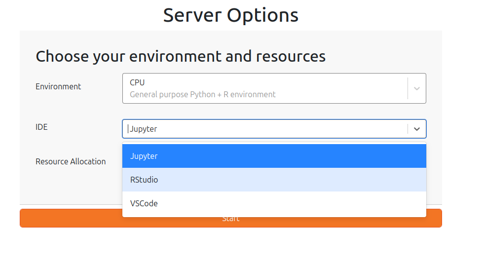

# JupyterHub Server

Config files for a JupyterHub (RStudio, Jupyter, VSCode platform) on the [National Research Platform](https://nationalresearchplatform.org/)

<https://eco4cast.nrp-nautilus.io/>

***in development***

- `hub_up.sh` Runs a kubernetes helm chart deploy using `values.yaml` and `secrets.yaml` configuration on Nautilus.  See [official docs](https://ucsd-prp.gitlab.io/userdocs/jupyter/jupyterhub-service/) for details.

